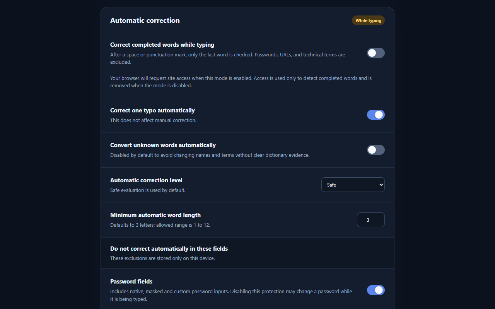

# Qswapp

Qswapp is a privacy-friendly Chrome extension that fixes text typed with the
wrong English or Russian keyboard layout.

```text
ghbdtn → привет
игыштуыы → business
```

**[Install Qswapp from the Chrome Web Store](https://chromewebstore.google.com/detail/qswapp/nemomlcejjfckiknobijmfgncaailpek)**



Everything runs locally in your browser. Qswapp has no backend, advertising,
analytics, or trackers and does not send typed or selected text anywhere.

## Features

- Fix selected text from the context menu or with `Ctrl+Shift+L`
  (`Command+Shift+L` on macOS).
- Correct completed words automatically while you type.
- Fix a single typo after converting the keyboard layout.
- Preserve punctuation, capitalization, formatting, and links.
- Ignore passwords and other sensitive fields.
- Protect custom words and configure site allow/block lists.
- Use separate settings for manual and automatic correction.
- Switch between English/Russian UI and light/dark themes.

Qswapp works with regular inputs, text areas, rich-text editors, and open
Shadow DOM fields.

## Install manually

1. Clone or download this repository.
2. Open `chrome://extensions` in Chrome or `edge://extensions` in Edge.
3. Enable **Developer mode**.
4. Choose **Load unpacked** and select the project directory.

## Use

Select text in an editable field, then choose **Fix keyboard layout** from the
context menu or press the keyboard shortcut.

Open the Qswapp icon to correct the current selection, enable automatic
correction, or adjust quick settings. Automatic correction requests optional
site access only when you enable it.

## Development

Requires Node.js 20 or newer.

```bash
npm install
npm test
npm run test:e2e
```

Set `QSWAPP_BROWSER` to a compatible browser executable if one is not detected
automatically.

### Local release

```bash
npm run release:local
```

The command creates `dist/qswapp-v<version>.zip` and a matching SHA-256 file.
The version comes from `manifest.json` and must match `package.json`. The ZIP
contains only the extension files and legal notices, with `manifest.json` at
the archive root, so it can be unpacked locally or uploaded to Chrome Web Store.

## Privacy and license

See the [Privacy Policy](PRIVACY.md) for data-handling details.

Qswapp is available under the [MIT License](LICENSE). Embedded frequency data
has separate attribution in [Third-Party Notices](THIRD_PARTY_NOTICES.md).
